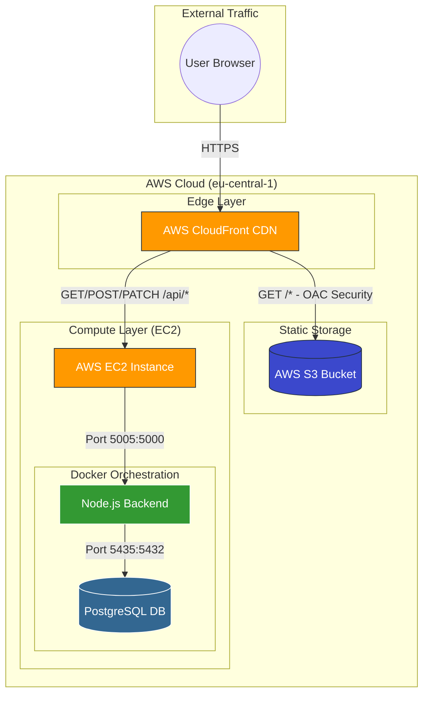

# System Architecture Diagram

This document describes the high-level cloud architecture for the Yoga Website project.

## 🏗 High-Level Architecture

---

## 🛰 Component Details

### 1. **Content Delivery Network (AWS CloudFront)**
- **Role:** Serves as the single entry point (HTTPS) for the entire application.
- **Caching:** Caches frontend assets (JS, CSS, Images) globally for low latency.
- **Reverse Proxy:** Routes traffic based on path:
    - `/*` (Default) $\rightarrow$ Fetches static React assets from **S3**.
    - `/api/*` $\rightarrow$ Proxies requests to the **EC2 Backend**.

### 2. **Static Hosting (AWS S3)**
- **Role:** Stores the production/staging build of the React application.
- **Security:** Configured with **Origin Access Control (OAC)**, making the bucket private. Only CloudFront has permission to read objects.

### 3. **Application Server (AWS EC2)**
- **Role:** Hosts the dynamic part of the application inside a Linux environment.
- **Docker Compose:** Manages two primary services:
    - **Backend (Node.js/Express):** Handles business logic and API requests.
    - **Database (PostgreSQL):** Stores persistent data (Schedules, Bookings).
- **Networking:**
    - The backend is exposed on host port **5005**.
    - The database is exposed on host port **5435**.

### 4. **Data Flow**
1. **Frontend Assets:** User requests the site $\rightarrow$ CloudFront $\rightarrow$ S3 $\rightarrow$ User Browser.
2. **API Requests:** User performs an action (e.g., booking a class) $\rightarrow$ CloudFront proxies to `/api/*` $\rightarrow$ EC2 (Port 5005) $\rightarrow$ Node.js Backend $\rightarrow$ PostgreSQL $\rightarrow$ Response returned via CloudFront.

---

## 🔒 Security & Performance
- **HTTPS Enforcement:** CloudFront automatically redirects all `http` traffic to `https`.
- **Latency:** Global Edge Locations ensure the frontend loads quickly regardless of the user's location.
- **Isolation:** The database is only accessible via the backend container or specific SSH tunnels, reducing the attack surface.
